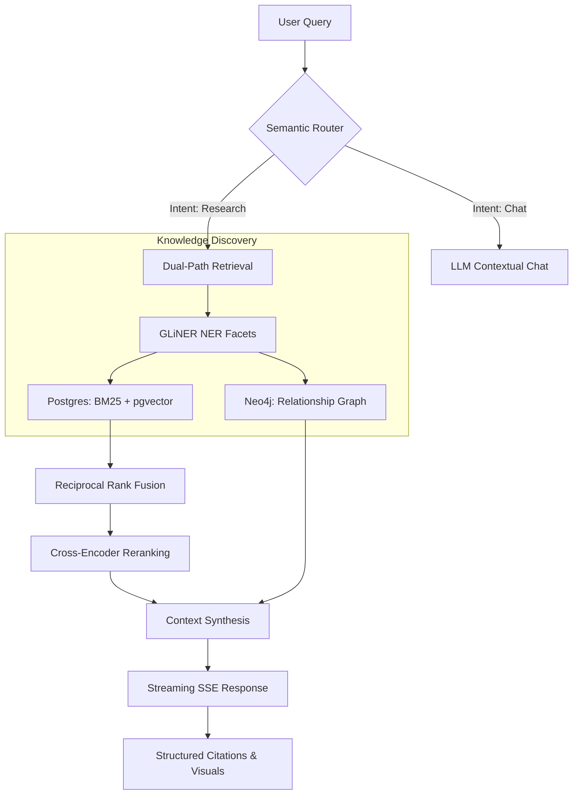

# Biosphere: NASA Space Biology Intelligence

```text
  ____  _                 _
 | __ )(_) ___  ___ _ __ | |__   ___ _ __ ___
 |  _ \| |/ _ \/ __| '_ \| '_ \ / _ \ '__/ _ \
 | |_) | | (_) \__ \ |_) | | | |  __/ | |  __/
 |____/|_|\___/|___/ .__/|_| |_|\___|_|  \___|
                   |_|
```

[](https://www.python.org/)
[](https://www.djangoproject.com/)
[](https://www.postgresql.org/)
[](https://neo4j.com/)
[](https://langchain.com/)

**Biosphere** is an advanced RAG (Retrieval-Augmented Generation) ecosystem designed specifically for NASA Space Biology literature. It bridges the gap between raw scientific papers (PMC) and actionable intelligence by combining multi-modal vector search with deep graph relationships.

---

## 🏗️ System Architecture

Biosphere employs a sophisticated **Research -> Strategy -> Execution** pipeline that ensures every scientific claim is grounded in the provided context.



---

## 🚀 Key Features

### 1. **Multi-Stage Intelligent Retrieval**

Unlike standard RAG, Biosphere uses a tiered approach:

- **GLiNER NER:** Extracts scientific entities (genes, organisms, proteins) to create "hard filters" for PostgreSQL.
- **Hybrid Search:** Combines **BM25 Full-Text Search** for exact terminology with **Cosine Similarity** (via pgvector) for semantic meaning.
- **Cross-Encoder Reranking:** Uses `MiniLM-L-6-v2` to score the top candidates, virtually eliminating hallucinations by ensuring only the most relevant chunks reach the LLM.

### 2. **Knowledge Graph Integration (Neo4j)**

Biosphere maps the "Social Network" of science:

- **Author Collaboration:** Tracks how researchers work together across different studies.
- **Citation Traversal:** Follows the chain of evidence from one paper to its referenced sources.
- **On-Demand Graph Gen:** Dynamically generates visual concept maps from LLM responses using localized graph extraction logic.

### 3. **Smart Ingestion Pipeline**

Automated extraction from **PubMed Central (PMC)**:

- **Semantic Chunking:** Breaks papers into logical sections (Abstract, Methods, Results) while maintaining context.
- **Figure Harvesting:** Automatically downloads, stores, and serves scientific figures via a secure, signed-token proxy.
- **Citation Mapping:** Extracts and resolves DOIs/PMCIDs to build a connected web of literature.

### 4. **NASA-Grounded LLM Logic**

Specialized prompt templates enforce strict scientific constraints:

- **Source Attribution:** Every factual claim requires an inline citation: `[Source: PMC123456]`.
- **Visual Evidence:** If an image is relevant, the system renders it with a scientific analysis paragraph.
- **Structured Reporting:** Can generate full comparative reviews and systematic summaries across multiple papers.

---

## 🛠️ Tech Stack

| Component             | Technology                                           |
| :-------------------- | :--------------------------------------------------- |
| **Backend**           | Django 5.0, Django REST Framework                    |
| **Vector DB**         | PostgreSQL + `pgvector` (1024-dim)                   |
| **Graph DB**          | Neo4j + `neomodel`                                   |
| **LLM Orchestration** | LangChain, LangGraph                                 |
| **Models**            | Gemini 2.5 Flash, Ollama (LFM-2.5-Thinking, Qwen2.5) |
| **NLP / NER**         | GLiNER (small-v2.1), Sentence-Transformers           |
| **Data Processing**   | BeautifulSoup4, Pandas, Tenacity (Retries)           |

---

## 📖 Core Logic Highlights

### **Semantic Routing** (`semantic_router.py`)

Determines the user's intent to save compute resources:

- `CHAT`: Quick greetings.
- `SEARCH_PAPERS`: Deep dive into biological facts.
- `SEARCH_GRAPH`: Discovery of author networks and collaborations.
- `FOLLOW_UP`: Maintains continuity in long scientific discussions.

### **The Reranking Workflow** (`search_papers.py`)

```python
# We don't just trust the vector search.
# We verify with a Cross-Encoder to ensure the Query-Chunk pair is strong.
ranked_chunks = rerank_chunks(user_query, all_chunks, top_k=5)
```

### **Secure Visual Proxy** (`models.py` & `views.py`)

Scientific images are served via signed URLs to prevent loopback/CORS issues in containerized environments while maintaining strict access control.

---

## 🛠️ Getting Started

### Prerequisites

- Python 3.10+
- PostgreSQL with `pgvector` extension
- Neo4j Instance
- Ollama (for local embeddings) or Gemini API Key

### Installation

1.  **Clone the repository:**
    ```bash
    git clone https://github.com/your-repo/biosphere.git
    cd NASA2
    ```
2.  **Environment Setup:**
    ```bash
    cp .env.example .env
    # Add your GEMINI_API_KEY and DB credentials
    ```
3.  **Sync Databases:**
    ```bash
    python manage.py migrate
    python manage.py sync_neo4j # Populates the Graph
    python manage.py backfill_search_vector # Prepares BM25
    ```
4.  **Run the Server:**
    ```bash
    python manage.py runserver
    ```

---

## 🔭 Roadmap

- [ ] Multi-PDF batch upload with image extraction.
- [ ] Real-time web fact-checking via DuckDuckGo integration.
- [ ] Collaborative research workspaces for multi-user chat.

---
